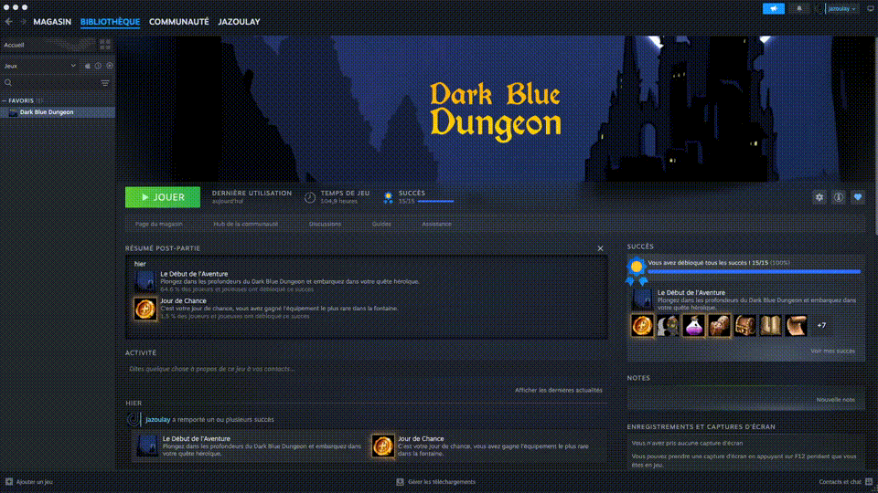

# Web2Desktop

Web2Desktop is an Electron framework designed to quickly turn any web interface into a desktop application.

It provides a ready-to-use desktop runtime, standard native utilities, and a plugin system. This enables immediate use without Electron code, while offering advanced customization for developers who want to extend the app’s behavior.

Web2Desktop clearly separates web front-end development from desktop software development, providing a modular, scalable foundation suited to a wide range of use cases.

---

## 📄 Documentation

1. Getting started
   - [Installation](./docs/INSTALLATION.md)
   - [Configuration](./docs/CONFIGURATION.md)
   - [Types](./docs/TYPES.md)
2. Bridge a Web Project
   - [Development](./docs/WEB_PROJECT_BRIDGE_DEVELOPMENT.md)
   - [Production](./docs/WEB_PROJECT_BRIDGE_PRODUCTION.md)
3. Window & API
   - [Control Window (Preload API)](./docs/CONTROL_WINDOW.md)
   - [TypeScript typings](./docs/TYPESCRIPT.md)
4. Assets
   - [Icons](./docs/ICONS.md)
5. Build & packaging
   - [Build and Make](./docs/BUILD_AND_MAKE.md)
   - [Windows](./docs/BUILD_WINDOWS.md)
   - [macOS](./docs/BUILD_MACOS.md)
   - [Linux](./docs/BUILD_LINUX.md)
6. Plugins
   - Steam
     - [Steam basics](./docs/STEAM.md)
     - [Achievements](./docs/STEAM_ACHIEVEMENTS.md)
   - [Your Custom Plugin](./docs/YOUR_CUSTOM_PLUGIN.md)
7. App Menu
   - [Create and interact with the app menu](./docs/CREATE_AND_INTERACT_APP_MENU.md)
8. Advanced docs
   - [Examples](./docs/EXAMPLES.md)
   - [Splash Screen](./docs/SPLASH.md)

A **Web2Desktop dedicated GPT** is available to help you use the framework.  
👉 [Access the Web2Desktop GPT](https://chatgpt.com/g/g-698268bc20e88191b50d2e5a85b2af66-web2desktop)

---

## ✨ Why Web2Desktop?

Building a desktop app from a web project often means rebuilding a full Electron application, even when the front end already exists. That adds extra development time, unnecessary complexity, and strong dependency on the Electron ecosystem.

Web2Desktop takes a different approach.

It provides a generic, ready-to-use desktop runtime that can connect to any web interface and immediately deliver the essential features of desktop software: window management, app menu, lifecycle, system events, and more.

The goal is twofold:

- enable fast conversion of an existing web front end into desktop software, without writing or maintaining Electron code
- offer an extensible foundation for Electron developers, through a simple plugin system to enrich and customize native app behavior

Web2Desktop clearly separates responsibilities:

- the web front end stays independent, free to use any stack and deployment model
- the desktop runtime manages the native environment and can be extended via plugins

This approach makes it possible to build desktop apps faster and more simply, while still enabling deeper customization when needed.

---

## 🎯 Who is it for?

Web2Desktop is designed for:

- web developers who want to ship desktop apps easily
- game developers packaging web-based games
- teams distributing internal tools as desktop software

---

## 🎮 Game developers

Web2Desktop includes a ready-to-use Steam plugin that makes it easy to integrate Steam
into a game built with web technologies (JavaScript / TypeScript).

This plugin simplifies achievements and Steam interactions
without having to write specific Electron code.

Web2Desktop is therefore well suited for web game developers who want to distribute their game
as a desktop application, especially on Steam.

---

## 🧱 What Web2Desktop provides out of the box

Web2Desktop goes beyond simply loading a web interface inside an Electron window.
It provides a complete desktop foundation with sensible defaults designed to speed up development.

Built-in features include:

- **Centralized configuration**  
  The entire application (web source, window, menu, plugins, desktop behaviors)
  is configured from a single file, without having to modify Electron code.

- **Simplified icon system**  
  App icons are handled via a predefined structure,
  compatible with Windows, macOS, and Linux, without complex setup.

- **Ready-to-use desktop utilities**  
  Window management, app menu, lifecycle, events, and communication
  between the web front end and the desktop runtime are already integrated.

- **Modular plugin system**  
  Native features can be extended with simple plugins,
  without modifying the application core.

Web2Desktop lets you focus on interface and business logic,
while relying on a stable, reusable desktop foundation.

---

## 📦 Project status

Web2Desktop is available in version **1.0.0**, stable and fully functional.

The project continues to evolve based on user feedback to improve the experience, flexibility, and feature set, while keeping a solid base.

---

## 💬 Community

Questions, ideas, or feedback?

👉 Join the **web2desktop Discord**:  
https://discord.gg/H8b36mdzgn

---

## 🤝 Contributing

Contributions are welcome!

Please read:

- [`CONTRIBUTING.md`](./CONTRIBUTING.md)
- [`CONTRIBUTING_FR.md`](./CONTRIBUTING_FR.md)

Whether it’s a bug report, a documentation improvement, or a feature idea — your input matters.

---

## 📜 License

Web2Desktop is licensed under the **MIT License**.

You are free to use it in personal, commercial, and open-source projects.

---

## ❤️ Support

If Web2Desktop helps you, you can support its development via GitHub Sponsors (coming soon).

---

## 🧩 Showcase

### Dark Blue Dungeon

[Dark Blue Dungeon](https://store.steampowered.com/app/3119460/Dark_Blue_Dungeon/) is an RPG video game built with JavaScript technologies and uses Web2Desktop to be deployed on Steam.

---

Built with care for the open-source community 🚀
